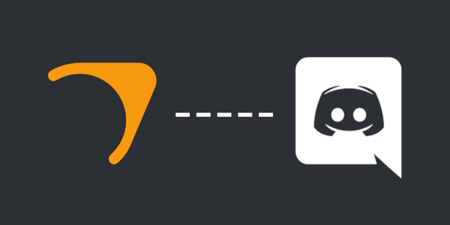

<p align="center">
  
</p>

# Source Dedicated Server Discord Bot  
> A Discord bot that allows you to communicate with your Source Dedicated Server.

Bringing Source server management into Discord. This simple bot allows you to run any kind of console commands using Valve's **R**emote **CON**sole protocol to your game servers through Discord.  

- [Source Dedicated Server Discord Bot](#source-dedicated-server-discord-bot)
  - [Getting Started](#getting-started)
    - [Prerequisites](#prerequisites)
    - [Installing](#installing)
    - [Building](#building)
  - [Configuration](#configuration)
    - [Required Options](#required-options)
  - [Running](#running)
  - [Usage](#usage)
  - [Miscellaneous](#miscellaneous)
    - [Built With](#built-with)
    - [Licensing](#licensing)

## Getting Started

### Prerequisites
* [Node.js](https://nodejs.org/en/download/) - v16.9.0 or higher
* [Git](https://git-scm.com/) - If you want to install the bot using method 2.

### Installing
*Method 1*
1. Download the [ZIP file](https://github.com/Retr0-01/srcds-discord-bot/archive/main.zip) containing the source code.
2. Extract it to your preferable location.
3. Delete the ZIP file if you want, we won't need it.

*Method 2*
1. Run GitBash in the directory you want the bot to install.
2. Type:
```sh
git clone https://github.com/Retr0-01/srcds-discord-bot.git
```
This will create a new directory which will contain the source code for the bot.

### Building
Assuming you have Node.js installed and you are in the directory you installed the bot, open a command prompt and type:
```batch
npm install
```
This will install all the required dependencies the bot needs to function.

## Configuration
Now that the bot is properly installed we need to configurate it. Go into the `src` directory and copy-paste, then rename the `example_config.json` file to `config.json`.

### Required Options
Option | Description
------------ | -------------
token | If you don't know what this is, check out [this section](https://discordjs.guide/preparations/setting-up-a-bot-application.html) of the Discord.js guide.
clientId | The client ID of your bot client.
guildIds | An array of Discord server IDs. This is the servers that will have the bot slash commands.

## Running
There are multiple ways to run the bot, both for a development environment and production. See the created NPM scripts for all the options.

## Usage
The main command from which you will manage your servers is `/server` and it includes all needed actions as subcommands in order to be simple and easy to use. All commands and options include descriptions so everything is pretty straight forward.

## Miscellaneous

### Built With
* [Discord.js Core Bot Template](https://github.com/Retr0-01/discordjs-core-bot)
* [SRCDS RCON](https://www.npmjs.com/package/srcds-rcon)

### Licensing
This repository is licensed under the MIT Licence. [Learn more.](https://github.com/Retr0-01/srcds-discord-bot/blob/main/LICENCE.md)
